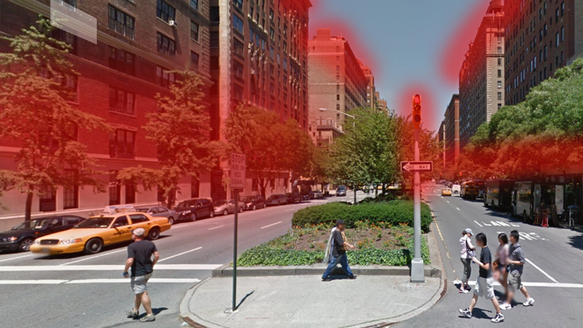

<!-- TODO:
camera FOV
map links
practice image rollover
 -->

# A field guide to spotting surveillance cameras

Let's watch some watchers!

This guide covers two skills:

* how to develop an awareness of surveillance cameras in public space
* how to gather a photographic dataset of surveillance cameras in the wild 

Our goal is to train a machine learning model to recognize surveillance cameras in photos and video.

## Tips for visually spotting surveillance cameras

Before you start, we recommend reading the following resources:

* The [EFF guide](https://www.eff.org/pages/surveillance-cameras) to surveillance cameras
* The [ACLU WA primer](https://theyarewatching.org/technology/video-surveillance-systems) on surveillance cameras
* Ingrid Burrington's section on NYC camera systems in this [infrastructure guide](http://seeingnetworks.in/nyc/)
* James Bridle's experience [photographing surveillance cameras in London](https://www.nytimes.com/2018/08/13/lens/surveillance-camera-photography.html). 

Be careful, and be aware of the law enforcement norms where you live.

In short, the main kinds of cameras are dome cameras, bullet cameras, traffic cameras, and pan-tilt-zoom cameras.

Cameras are often spotted on poles, ledges, overhangs, rooftops. They are often spotted watching parking lots, doors, banks, intersections, and government buildings. Indoors, they are typically spotted on roofs and near cash registers. They are typically positioned right above human height or very far above it. The box that is often seen near a camera is an infrared light for night vision. 

_Red = more likely to see cameras_

Often several cameras clump together, so if you see one, look for more.

Be aware of local kinds of cameras, for example in New York, and of new kinds of cameras, such as the Amazon Ring and the LinkNYC booths.

Check if the city you live in has an existing map of surveillance cameras. Several cities (like New York) have maps of camera locations, but they may be outdated or partial.

When spotting cameras, privilege institutional surveillance (e.g. police, government, and commercial systems) over citizen surveillance (e.g. don't photograph people's houses or living rooms!)--although the line between the two is becoming increasingly blurred.

Be aware that sometimes a camera is positioned as a deterrent, and does not actually work! Also, even if a camera works, no one may be watching.

TODO: discuss camera positioning and field of view

## Where's Waldo?

Practice spotting the cameras in the below images:

## Ways to detect cameras on the network

NOTE: Do not employ any of these methods if they are illegal where you live. Also, needless to say, use these methods to protect yourself, not to surveil others.

For indoor hidden cameras, try using a [radio frequency signal detector](https://www.techlicious.com/tip/the-secrets-to-finding-hidden-cameras/).

Cameras are often publicly networked these days, so try [Insecam](https://www.insecam.org/) (an online directory of cameras), iSpy, or Shodan. Note that many publicly cameras are also controllable; e.g. iSpy will let you change the angle and zoom of a camera.

You can also run a portscan yourself using IP Scanner or Net Analyzer (from your phone) or your command-line utility of choice. That can turn up any cameras that are connected to your local network.

## Taking good images to use in a machine learning model

There are two parts to be aware of: the dataset itself (i.e. the pile of images) and the labeling of the dataset.

First, we want the dataset to mirror how the model will be deployed in real life. So, we would recommend taking images that are as diverse as possible:

* from a variety of angles (left to right, top to bottom)
* in many different lighting conditions (morning, afternoon, evening)
* from different distances (close, middle distance, and far away are all helpful--note that if a camera is very close, people are likely to be able to recognize it without the help of an ML model)
* at different locations in your photograph (e.g. at different coordinates and with different rotations)
* at different resolutions (e.g. phone camera vs DSLR)
* including occlusion (i.e. it's okay if part of the surveillance camera is blocked, since we want the model to be robust to that case when deployed)
* if possible, capture as diverse a set of models of cameras as possible, and from different cities

Second, please label your images consistently. For our model we only include the "head" of the camera, not the "body," and draw the box as tightly as possible. We also only have one class for all kinds of cameras, which is just called "surveillance-camera" (later we might make more classes). Also, be sure to label *all* cameras in an image if there are multiple!

You can use software like [vott](https://github.com/microsoft/VoTT) to label your cameras with bounding boxes, and export the annotations as JSON or Pascal VOC (either format is fine).

Please send us your images and labels at sousveillance@protonmail.com. Any questions and feedback are welcome as well. Feel free to forward this guide to anyone you think will find it useful. Thanks!
